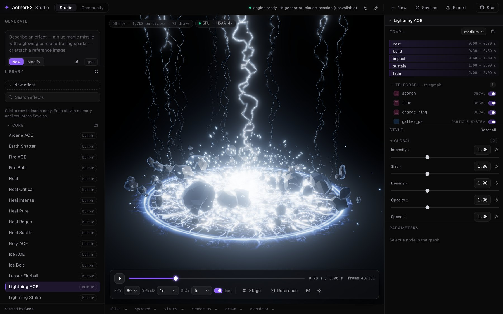
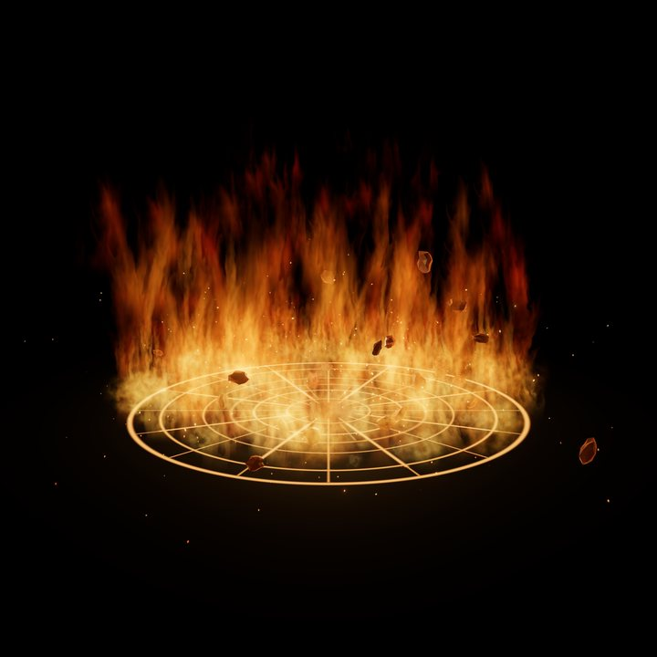
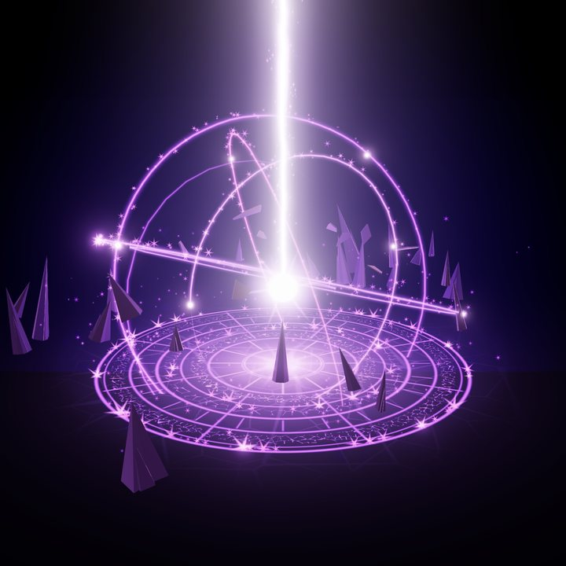
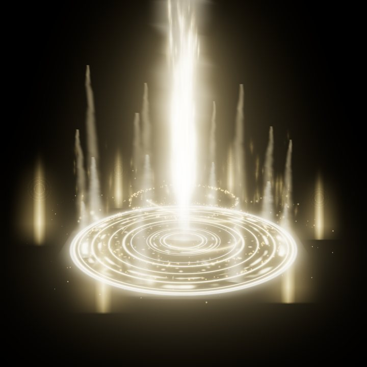
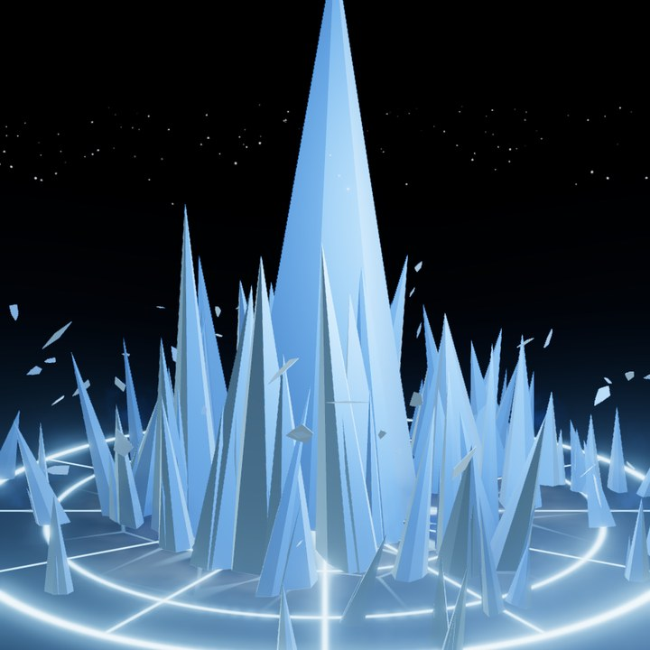

# AetherFX

**Game VFX that an AI agent can author.** Describe an effect, or hand your agent a concept sheet, and it builds the effect from typed building blocks, looks at its own renders, and iterates. The result is one small JSON file that plays the same everywhere.



- **A library of ready effects** you can preview, tweak with sliders and export.
- **A studio** that runs locally in your browser: GPU preview at 60 fps, style sliders per part of the effect, playback and effect speed, search.
- **Built for agents**: every authoring action is a tool over the Model Context Protocol (MCP), with the guides an agent needs served alongside.
- **Deterministic and portable**: no shaders to write, no binary assets. Textures and meshes are procedural, and the same simulation runs in the studio, in exports and in your game through a small C library.
- **MIT licensed**, including every effect. Use it in commercial games.

## Effects

| | | | |
|:---:|:---:|:---:|:---:|
|  |  |  |  |
| Fire AOE | Lightning AOE | Arcane AOE | Holy AOE |
|  |  |  |  |
| Fire Bolt | Ice Bolt | Lightning Strike | Earth Shatter |
|  |  |  |  |
| Heal (+5 variants) | Teleport (+3 variants) | Poison Target | Ice AOE |

Also in the library: Lesser Fireball, Shadow AOE, Void Nebula.

New and still being polished: Shield Buff (standard, ice, fire and poison, each in a basic and a rune style), Life Drain, Corruption Drain and Soul Drain (each as a flowing stream, a thin beam and a thick volumetric beam), Homing Arcane Missile, Chain Lightning, Meteor, Flame Wave and Frost Nova.

All of them live in [`examples/effects`](examples/effects) as plain JSON, and the scripts that generate the effect families are in [`tools/generators`](tools/generators).

## Quick start

You need CMake, a C++20 compiler and Python 3.10 or newer.

```bash
git clone https://github.com/holokat/AetherFX.git
cd AetherFX
cmake --preset default && cmake --build --preset default
python3 -m venv python/.venv && python/.venv/bin/pip install -e 'python[studio]'
python/.venv/bin/aetherfx-studio
```

The studio opens at <http://127.0.0.1:8770>. Pick an effect in the Library, drag the Style sliders, change the speed, orbit with the mouse. Built-in effects are never modified: you always work on a copy, and **Save as** adds it to your own list.

## Use it with your AI agent

With the studio running, point any MCP client at it and ask for an effect. Whatever the agent builds appears live in the studio.

```bash
claude mcp add --transport http aetherfx http://127.0.0.1:8770/mcp
```

Open <http://127.0.0.1:8770/mcp> in a browser for the agent documentation: connection snippets for Claude Code, Claude Desktop, Cursor and Codex, the authoring workflow, and every tool. Agents can read the same guides as MCP resources, or from `/llms.txt`.

The studio's own **Generate** box uses your Anthropic API key or your local Claude Code login if you have one. It is optional: everything else works without it.

## Use effects in your game

| Export | What you get | Status |
|---|---|---|
| Flipbook | Sprite sheet + manifest, plays in any engine | Ready |
| Package | Effect, resolved runtime data, baked textures and meshes | Ready |
| Unreal Engine | Package + the AetherFX plugin (UE 5.8): import and cast from an actor | Ready |
| Unity, Godot | The data package | Runtime not built yet: use the Flipbook for now |

The engine also builds `libaetherfx`, a small C library that runs the same deterministic simulation inside your game. See [`docs/ENGINE_INTEGRATION.md`](docs/ENGINE_INTEGRATION.md) and [`docs/UNREAL.md`](docs/UNREAL.md).

## Contribute an effect

The **Community** view in the studio lists effects contributed by pull request, credited to their authors. Most people will let their agent do the work, so the guide is written for agents:

1. Build an effect with your agent and save it.
2. Run the contribution check: `python -m aetherfx.community check your_effect.json`
3. Open a pull request that adds `community/effects/<name>.json`.

Everything an effect must pass, what qualifies and what does not is in [`CONTRIBUTING.md`](CONTRIBUTING.md). If you like the project, a star helps others find it.

## Learn more

- [`docs/ARCHITECTURE.md`](docs/ARCHITECTURE.md): how the pieces fit
- [`docs/VOCABULARY.md`](docs/VOCABULARY.md): node types, parameters, texture ops
- [`docs/CONTROLS.md`](docs/CONTROLS.md): style sliders and effect speed
- [`docs/AGENT_API.md`](docs/AGENT_API.md): the tool API (CLI, JSON-RPC, Python, MCP)
- [`docs/COMMUNITY.md`](docs/COMMUNITY.md) and [`docs/REVIEWING.md`](docs/REVIEWING.md): the community collection
- [`docs/BACKLOG.md`](docs/BACKLOG.md) and [`docs/ROADMAP.md`](docs/ROADMAP.md): what is missing and what is next

## License and credits

MIT, see [`LICENSE`](LICENSE). Every dependency is permissive and nothing proprietary is bundled: the audit is in [`THIRD_PARTY_NOTICES.md`](THIRD_PARTY_NOTICES.md). All images in this repository were rendered by AetherFX from its own effects.

Started by [Gene](https://x.com/cogentgene1).
